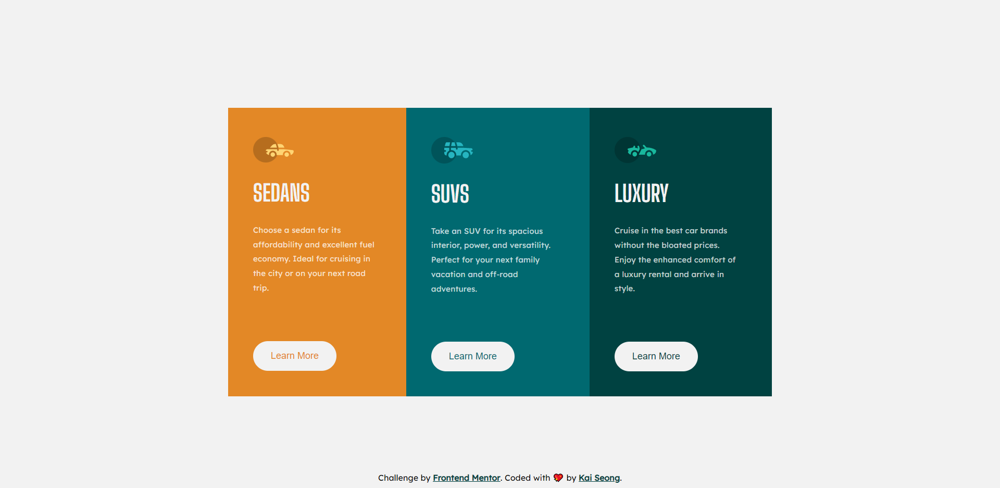

# ➰ 3-Column Preview Card

This is a solution to the [3-Column Preview Card component challenge on Frontend Mentor](https://www.frontendmentor.io/challenges/3column-preview-card-component-pH92eAR2-).

## ❓ The challenge

Users should be able to:

- View the optimal layout depending on their device's screen size
- See hover states for interactive elements

## 📸 Screenshots

## 🔗 Links

- [Solution URL](https://www.frontendmentor.io/solutions/responsive-3column-preview-card-using-scss-css-flexbox-SkZerQx8q)
- [Live Site URL](https://column-preview-card-component-c6v.pages.dev/)
